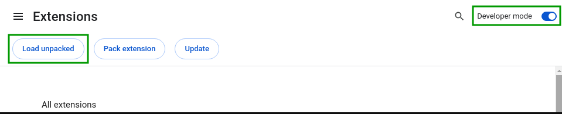
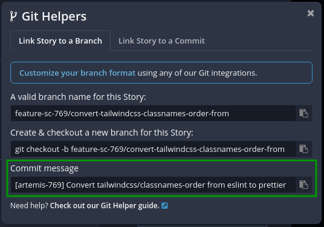
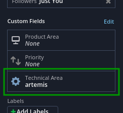
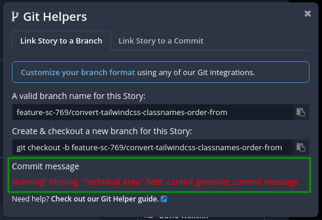

# Chrome extension - Git commit message generator for shortcut

Adds a Git helper field in Shortcut with a generated commit message

## Usage
- Clone the repo
- Turn on Developer mode in chrome://extensions/
- Load as an unpacked extension
- A "Commit message" section is added onto the Git Helpers dialog
- Enjoy

**"Technical area" must be set on the story**

If you haven't set it, you will get a warning message

